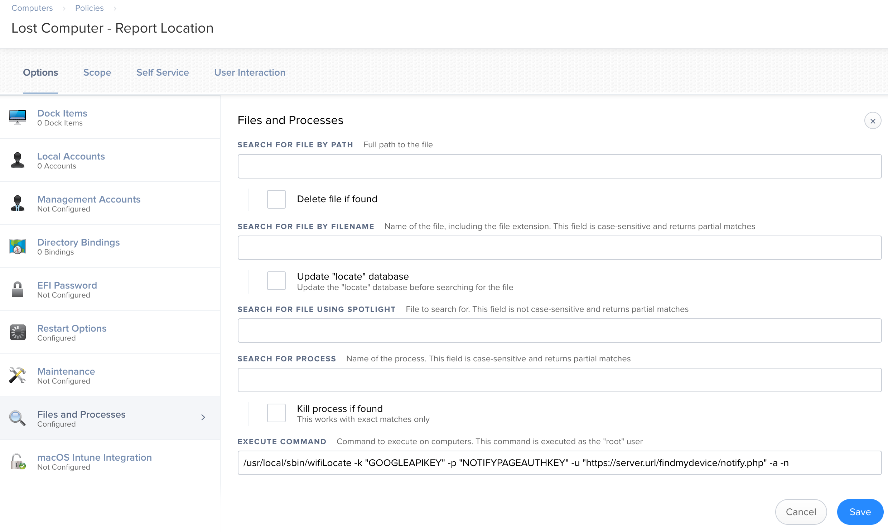

# wifiGeoLocate
This is a simple script that helps find lost computers with JAMF. The script is installed on the client and executed with
a policy that is triggered using "network state change" event.  For laptops that have PowerNap enabled, the network 
state change policy will trigger this process when the lid is closed thus notifying Slack of the computers where abouts.  
Obviously, the computer will need a network connection to send the notification.  This means being in range of a known
wireless network, having a cellular connection, or be wired to ethernet.  Most of the time being in range of a known 
wireless network is sufficient.

This uses the Google GeoLocation API to determine the location. This is good enough to narrow in on a building for our 
campus.

## Initial Setup
1)  For notifications, create a script on a webhost to handle notifications (see sample_notify.php)
2)  Create a network change triggered policy in JAMF to execute the script (see example below).  It is suggest to scope
this policy to only computers that are lost using a static group.
3)  Install latest release of wifiLocate on clients.
4)  Obtain a Google GeoLocate Key: https://developers.google.com/maps/documentation/geolocation/get-api-key

## Running wifiGeoLocate
Run with arguments below:

  -h : Print Help

  -v : Print Version

  -k : (Required) Google API Key

  -u : Notify URL

  -p : Key to Notify Web URL (Required with -n and -u)

  -d : Display location in STDOUT
  
  -a : Play Find My Device alert sound at full volume.

  -n : Display location and Notify using -u URL.

To notify of location:
./main.py -k "GoogleAPIKey" -a -n -u "https://server.domain.tld/path/to/sample_notify.php" -p "RandomKeyLocatedinNotify.phpPage"

To report location back to terminal without notifying:
./main.py -k "GoogleAPIKey" -d

## Building with PyInstaller
Script can be used without building with PyInstaller.  PyInstaller just ensures it will run under different OS versions 
since the python binary is built in.  Releases above are built with Python 3.6.

`
pyinstaller main.py --onefile

cp -rfv dist/main ./wifiLocate

sudo make pkg
`

## Sample JAMF Policy

